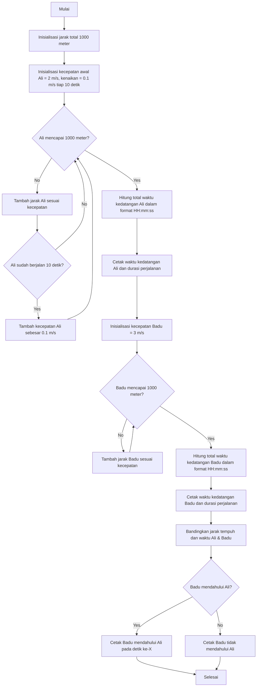

```mermaid
graph TD
    A[Mulai] --> B[Inisialisasi jarak total 1000 meter]
    B --> C[Inisialisasi kecepatan awal Ali = 2 m/s, kenaikan = 0.1 m/s tiap 10 detik]
    C --> D{Ali mencapai 1000 meter?}
    D -- No --> E[Tambah jarak Ali sesuai kecepatan]
    E --> F{Ali sudah berjalan 10 detik?}
    F -- Yes --> G[Tambah kecepatan Ali sebesar 0.1 m/s]
    F -- No --> D
    G --> D
    D -- Yes --> H[Hitung total waktu kedatangan Ali dalam format HH:mm:ss]
    H --> I[Cetak waktu kedatangan Ali dan durasi perjalanan]

    I --> J[Inisialisasi kecepatan Badu = 3 m/s]
    J --> K{Badu mencapai 1000 meter?}
    K -- No --> L[Tambah jarak Badu sesuai kecepatan]
    L --> K
    K -- Yes --> M[Hitung total waktu kedatangan Badu dalam format HH:mm:ss]
    M --> N[Cetak waktu kedatangan Badu dan durasi perjalanan]

    N --> O[Bandingkan jarak tempuh dan waktu Ali & Badu]
    O --> P{Badu mendahului Ali?}
    P -- Yes --> Q[Cetak Badu mendahului Ali pada detik ke-X]
    P -- No --> R[Cetak Badu tidak mendahului Ali]

    Q --> S[Selesai]
    R --> S
```