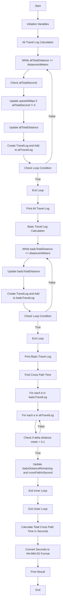

```mermaid
flowchart TD
    A[Start] --> B[Initialize Variables]
    B --> C[Ali Travel Log Calculation]
    C --> D[While aliTotalDistance <= distanceInMeters]
    D --> E[Check aliTotalSecond]
    E --> F[Update speedAliMps if aliTotalSecond != 0]
    F --> G[Update aliTotalDistance]
    G --> H[Create TravelLog and Add to aliTravelLog]
    H --> I[Check Loop Condition]
    I -->|True| J[Exit Loop]
    I -->|False| D
    J --> K[Print Ali Travel Log]
    K --> L[Badu Travel Log Calculation]
    L --> M[While baduTotalDistance <= distanceInMeters]
    M --> N[Update baduTotalDistance]
    N --> O[Create TravelLog and Add to baduTravelLog]
    O --> P[Check Loop Condition]
    P -->|True| Q[Exit Loop]
    P -->|False| M
    Q --> R[Print Badu Travel Log]
    R --> S[Find Cross Path Time]
    S --> T[For each b in baduTravelLog]
    T --> U[For each a in aliTravelLog]
    U --> V[Check if delta distance meter < 0.1]
    V -->|True| W[Update baduDistanceRemaining and crossPathInSecond]
    W --> X[Exit Inner Loop]
    V -->|False| U
    X --> Y[Exit Outer Loop]
    Y --> Z[Calculate Total Cross Path Time in Seconds]
    Z --> AA[Convert Seconds to HH:MM:SS Format]
    AA --> AB[Print Result]
    AB --> AC[End]
```