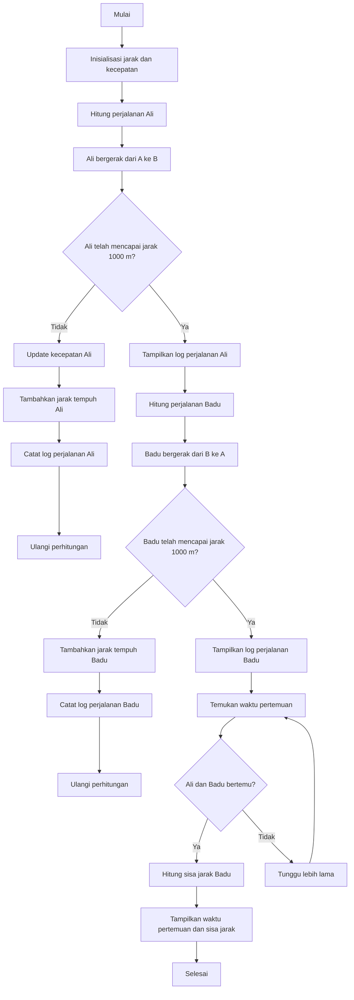

```mermaid
flowchart TD
    A[Mulai] --> B[Inisialisasi jarak dan kecepatan]
    B --> C[Hitung perjalanan Ali]
    C --> D[Ali bergerak dari A ke B]
    D --> E{Ali telah mencapai jarak 1000 m?}
    E -- Tidak --> F[Update kecepatan Ali]
    F --> G[Tambahkan jarak tempuh Ali]
    G --> H[Catat log perjalanan Ali]
    H --> I[Ulangi perhitungan]
    E -- Ya --> J[Tampilkan log perjalanan Ali]

    J --> K[Hitung perjalanan Badu]
    K --> L[Badu bergerak dari B ke A]
    L --> M{Badu telah mencapai jarak 1000 m?}
    M -- Tidak --> N[Tambahkan jarak tempuh Badu]
    N --> O[Catat log perjalanan Badu]
    O --> P[Ulangi perhitungan]
    M -- Ya --> Q[Tampilkan log perjalanan Badu]

    Q --> R[Temukan waktu pertemuan]
    R --> S{Ali dan Badu bertemu?}
    S -- Ya --> T[Hitung sisa jarak Badu]
    T --> U[Tampilkan waktu pertemuan dan sisa jarak]
    S -- Tidak --> V[Tunggu lebih lama]
    V --> R
    U --> X[Selesai]
```